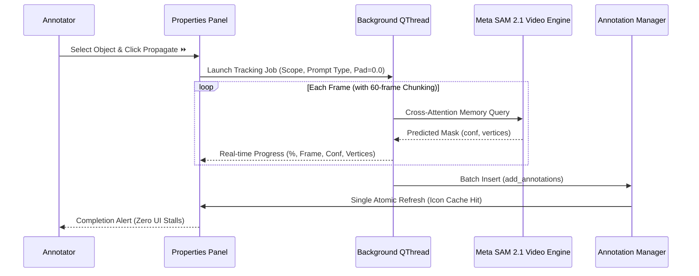

# Annotation & Tracking Workflow

This guide details the interactive annotation lifecycle, prompt modes, polygon conversion, and multi-frame propagation in the **SAM2 Video Polygon Annotator**.

---

## 1. The Annotation Lifecycle

```
Select Frame → Select Class → Prompt SAM 2 → Generate Mask → Convert to Polygon → Refine Vertices → Propagate Forward → Review & Export
```

### Step 1: Frame Navigation
- Browse frames on the bottom **Frame Timeline** or use **Left / Right Arrow** (`A` / `D`) keys.
- Filter frames by review status: *All*, *Unreviewed*, *Reviewed*, or *Negative*.

### Step 2: Selecting Class & Mode
- In the **Class Panel** on the left dock, select the active object category (e.g., `scooter`).
- In the toolbar, select your prompting method:
  - **Positive Point (`+` / key `2`)**: Marks a foreground point on the target object.
  - **Negative Point (`-` / key `3`)**: Marks a background point to exclude non-target regions.
  - **Bounding Box (`Box` / key `4`)**: Click and drag a tight box encompassing the target object.
  - **Manual Polygon (`Poly` / key `5`)**: Manually click arbitrary boundary points.

---

## 2. Interactive SAM Prompting & Refinement

1. **Initial Point / Box**: Click inside the desired object or drag a bounding box on the canvas. SAM immediately predicts the instance mask.
2. **Refinement Points**:
   - If parts of the object are missing, add another **Positive Point** on the omitted region.
   - If background or adjacent objects are falsely included, add a **Negative Point** on the incorrect area.
3. The adapter merges existing prompts and recalculates the mask in real-time.

---

## 3. Mask-to-Polygon Conversion

Once segmentation succeeds, the binary mask is automatically vectorized:
- **Contour Finding**: Detects closed exterior boundaries using topological hierarchy analysis.
- **Ramer-Douglas-Peucker (RDP) Simplification**: Reduces noisy pixel steps while preserving sharp corners and curve fidelity.
  - Controlled by `tolerance_ratio` (default: `0.004` of the object diagonal).
  - Minimum area filter rejects spurious noise fragments (< 20 px).
- The resulting polygon has at least 3 vertices and coordinates normalized between `0.0` and `1.0`.

---

## 4. Manual Polygon Editing

Switch to **Edit Mode** (`E`) or double-click any polygon to adjust vertices:
- **Move Vertex**: Click and drag any existing vertex handle.
- **Insert Vertex**: Click anywhere along an edge segment to split it and create a new control point.
- **Delete Vertex**: Right-click on a vertex handle and choose **Delete Vertex**. Polygons must maintain at least 3 vertices.
- **Delete Polygon**: Select the polygon and press `Delete` or `Backspace`.
- **Undo / Redo**: Full multi-level history stack via `Ctrl+Z` and `Ctrl+Y`.

---

## 5. Multi-Frame Propagation (Video Tracking)

When an object is annotated in frame $t$:



### A. Propagation Scopes
Configure the tracking range in the **Tracking & Propagation** dock:
1. **Fixed Frame Count**: Tracks through a specified number of frames (e.g. 10, 30, 60, or 100 frame presets, or custom spinbox).
2. **Until Next Keyframe**: Automatically propagates until the next marked keyframe is encountered.
3. **Until End of Video**: Propagates continuously through all remaining frames of the video sequence.

### B. Prompt Modalities for Tracking
Choose how the tracking engine initializes guidance for subsequent frames:
- **🔲 Box Prompt** (Default): Uses the bounding box from the reference frame (with previous frame tracking reference) to guide cross-attention.
- **📍 Centroid Point**: Uses the geometric centroid of the object as a point prompt.
- **🔲+📍 Box + Center Point**: Combines both outer bounding box boundaries and internal center point guidance.

### C. Zero Box Padding (`padding = 0.0`)
Bounding boxes are generated with exact mathematical extents (`box_padding = 0.0`), preventing unintended boundary dilation and keeping bounding contours tightly hugging the target object.

### D. Real-Time Status & Progress Feedback
The non-blocking progress dialog and main window status bar provide continuous live feedback:
- Current frame ID and overall percentage completion.
- Mask prediction confidence score (e.g., `conf=0.97`).
- Polygon vertex count (e.g., `42 vertices`).
- Live terminal standard output logs for headless tracking observation.

### E. High-Performance Batch Insertion & Zero UI Freezes
- Previous per-frame insertion triggered hundreds of thumbnail regenerations. The engine now uses `add_annotations()` to commit all tracked frames in a **single atomic transaction**.
- An in-memory thumbnail icon cache (`_icon_cache`) prevents repeated disk reads, keeping the interface fluid even after propagating hundreds of frames.

---

## 6. Frame Review Statuses

Every frame has one of three statuses:
- **Unreviewed** (Default): Frame has not been validated by the user.
- **Reviewed** (`R`): Frame has verified annotations ready for training export.
- **Negative / Background** (`N`): Frame contains zero targets of interest (acts as background negative sample in training to minimize false positives).

---

## 7. Next Steps

- Consult the [User Guide](user_guide.md) for full shortcut controls and daily UI operations.
- See [Export Formats Guide](export_formats.md) and [YOLOv8 Export](yolo_export.md) to export your annotated dataset for model training.
- Check [Troubleshooting](troubleshooting.md) for resolution of common issues.


