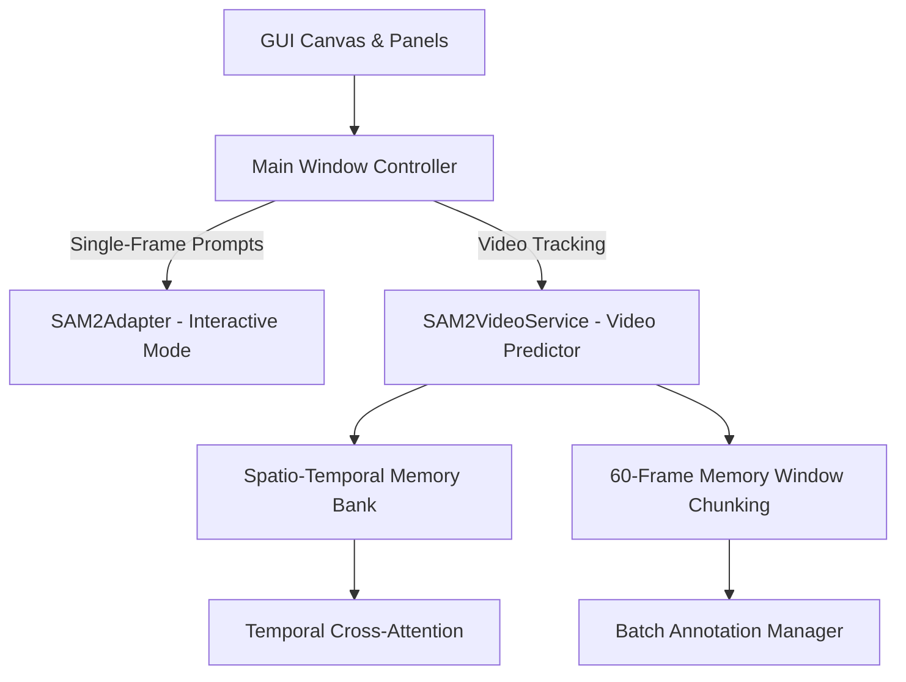

# SAM 2 Model Setup & Architecture

The **SAM2 Video Polygon Annotator** features a dual-engine architecture to deliver both lightning-fast interactive single-frame segmentation and state-of-the-art multi-frame video propagation.

---

## 1. Supported SAM 2.1 Checkpoints

The application natively supports Meta's official SAM 2.1 Hiera checkpoint weights:

| Model Checkpoint | Parameters | Typical Speed | Recommended Hardware | Primary Use Case |
| :--- | :--- | :--- | :--- | :--- |
| `sam2.1_hiera_tiny.pt` | Tiny (~38M) | Fast (~15-30ms) | CPU or 4 GB GPU (Default) | Real-time interactive annotation & fast tracking |
| `sam2.1_hiera_small.pt` | Small (~46M) | Fast (~25-45ms) | 4 GB - 6 GB GPU | Balanced tracking with improved edge details |
| `sam2.1_hiera_base_plus.pt`| Base+ (~80M) | Balanced (~40-70ms) | 6 GB - 8 GB GPU | High accuracy on complex object shapes |
| `sam2.1_hiera_large.pt` | Large (~224M) | High Accuracy (~90ms) | 8 GB+ GPU | Maximum segmentation fidelity & challenging occlusions |

> [!TIP]
> The default checkpoint is `sam2.1_hiera_tiny.pt`, offering the optimal trade-off between segmentation quality, low VRAM footprint, and high inference speed across both GPU and CPU.

---

## 2. Checkpoint Placement & Download

Place downloaded model weights in the project root directory or the `checkpoints/` folder:

```
D:\SAM3\
  ├── checkpoints\
  │   └── sam2.1_hiera_tiny.pt   <- Recommended location
  ├── sam2.1_hiera_tiny.pt       <- Root location fallback
  ├── main.py
  └── ...
```

### Direct Download Commands:
```powershell
# Windows PowerShell
Invoke-WebRequest -Uri "https://dl.fbaipublicfiles.com/segment_anything_2/092824/sam2.1_hiera_tiny.pt" -OutFile "sam2.1_hiera_tiny.pt"
```
```bash
# Linux / macOS
wget https://dl.fbaipublicfiles.com/segment_anything_2/092824/sam2.1_hiera_tiny.pt
```

Ultralytics and Meta adapters can also download checkpoints automatically on first run when internet connectivity is available.

---

## 3. Dual-Engine Architecture

The codebase separates single-frame interactive segmentation from temporal video tracking:



### A. Interactive Single-Frame Engine (`SAM2Adapter`)
- Handles real-time clicks on the canvas (foreground points `+`, background points `-`, bounding boxes, and text prompts).
- Maintains prompt history for the active frame.
- Automatically vectorizes binary output masks into polygon vertices via contour hierarchy and Ramer-Douglas-Peucker (RDP) polygon simplification.

### B. Spatio-Temporal Video Predictor (`SAM2VideoService`)
- Powered by Meta's official `build_sam2_video_predictor` engine.
- Maintains a temporal memory bank of past frame object features and cross-attends across subsequent frames.
- Supports three prompt modalities for tracking:
  - **Box Prompt** (`box`): Draws reference bounding box from source/previous frame.
  - **Centroid Point** (`point`): Positions foreground prompt at the geometric center of the object.
  - **Box + Center Point** (`combined`): Combines outer bounding box constraints with an internal centroid point.
- **Zero Box Padding**: Default padding ratio is `0.0` to preserve tight bounding boundaries without artificial inflation.

### C. 60-Frame Memory Window Chunking
Tracking long video sequences (e.g. hundreds of frames) can lead to GPU VRAM exhaustion if memory tokens accumulate indefinitely.
- The tracking engine divides long sequences into **60-frame memory chunks** (`MAX_PROPAGATION_CHUNK = 60`).
- Between chunks, the inference state is gracefully refreshed while preserving object identity and boundary continuity.
- Eliminates out-of-memory errors on arbitrary video lengths.

---

## 4. Hardware Acceleration & Device Configuration

The application automatically checks device availability on startup:

- **CUDA**: Preferred when an NVIDIA GPU and CUDA runtime are present.
- **CPU**: Supported across all platforms as an offline fallback.
- **Precision**:
  - `fp32`: Standard 32-bit single precision for CPU and GPUs.
  - `fp16` / `bfloat16`: Half-precision automatically enabled on supported GPUs, cutting VRAM usage by ~50% and doubling inference throughput.

Switch the active device dynamically through the GUI (**Settings > Model Settings**) or via the command line:
```bash
python main.py --device cuda
# or
python main.py --device cpu
```

---

## 5. OOM (Out-of-Memory) Recovery

If the model encounters an out-of-memory condition during interactive segmentation or batch tracking:
1. The error is safely intercepted without crashing the application.
2. `device_utils.clear_memory()` flushes CUDA caches and triggers Python garbage collection.
3. Temporary tensor buffers and memory bank states are released.
4. The user is prompted to reduce resolution, switch precision to `fp16`, or use CPU fallback.
5. All existing annotations and project files remain completely intact.

---

## 6. Mock Adapter for Headless Testing

For CI/CD pipelines and automated testing without requiring GPU hardware or large weight downloads, the test suite leverages `MockSAM2Adapter` (`sam2_annotator/models/sam2_adapter.py`). The mock adapter simulates realistic circular and geometric masks matching prompt coordinates across all 50+ unit tests.

---

## 7. Next Steps

- Explore the [Annotation & Tracking Workflow](annotation_workflow.md) to learn how to guide SAM 2 with points and boxes.
- Read the [User Guide](user_guide.md) for full keyboard shortcuts and project workflow.
- Refer to [Troubleshooting](troubleshooting.md) for model loading and OOM resolution tips.


